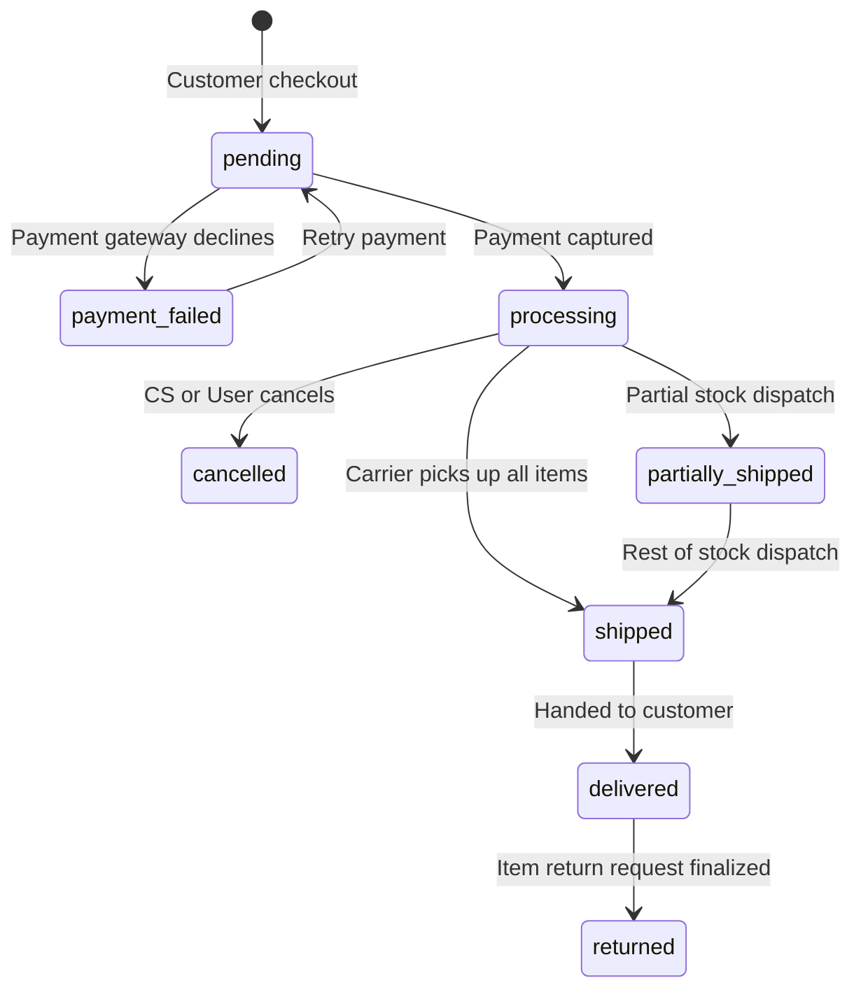

# Business Rules & Integrity Constraints Documentation

This document explains the enterprise business rules and database constraints designed to maintain data consistency, prevent financial leakage, and validate state transitions for the **OmniShop** database.

---

## 1. Core Financial Integrity Rules

To protect e-commerce profit margins and prevent ledger irregularities, the database enforces the following rules:

### 1.1 Non-Negative Pricing & Cost
*   **Rule:** A product's listing price and wholesale cost must always be greater than or equal to zero.
*   **Enforcement:** `CHECK (price >= 0.00)` and `CHECK (cost >= 0.00)` on the `products` table.
*   **Business Value:** Prevents accidental negative prices (which could allow customers to receive credits during checkouts) or negative supplier costs.

### 1.2 Positive Item Quantities
*   **Rule:** Order quantities must be positive.
*   **Enforcement:** `CHECK (quantity > 0)` on the `order_items` table.
*   **Business Value:** Prevents malicious payloads attempting to inject negative or fractional item counts during checkout to reduce total order price.

### 1.3 Automatic Net Line-Item Price Calculation
*   **Rule:** Line-item net price must be calculated consistently as `(quantity * unit_price) - discount_amount`.
*   **Enforcement:** Evaluated via a generated column `net_price NUMERIC(12, 2) GENERATED ALWAYS AS ((quantity * unit_price) - discount_amount) STORED`.
*   **Business Value:** Eliminates the risk of application bugs writing mismatched totals, providing a single source of truth for downstream business intelligence (BI) and tax reporting.

---

## 2. Inventory & Logistics Constraints

### 2.1 Double-Selling Prevention (Stock Reservation)
*   **Rule:** The quantity of items reserved for pending checkouts must never exceed the total physical stock in a warehouse.
*   **Enforcement:** `CHECK (quantity_reserved <= quantity_on_hand)` on the `inventory` table.
*   **Business Value:** Guarantees that stock cannot be double-sold. When a customer adds an item to their cart, a short-lived reservation is created. The check ensures the system cannot allocate stock that doesn't exist.

### 2.2 Warehouse Isolation
*   **Rule:** A single product's inventory records are grouped per warehouse to support multi-site fulfillment.
*   **Enforcement:** `UNIQUE (product_id, warehouse_code)` on the `inventory` table.
*   **Business Value:** Ensures clean aggregations for warehouse management software (WMS) and prevents duplicate inventory rows for the same product in a single facility.

---

## 3. Order Status State Machine (Design Guideline)

An order progresses through distinct stages. While complex, conditional state transitions are validated by application microservices, the database documents and supports this lifecycle:

| Order Status | Permitted Next Statuses | Business Trigger |
| :--- | :--- | :--- |
| `pending` | `processing`, `payment_failed`, `cancelled` | Order created, awaiting card authorization. |
| `payment_failed` | `pending`, `cancelled` | Card declined. Customer can retry or cancel. |
| `processing` | `partially_shipped`, `shipped`, `cancelled` | Payment cleared, order sent to warehouse picking. |
| `partially_shipped`| `shipped` | Multiple packages; some items are en route. |
| `shipped` | `delivered` | Carrier scans packages. |
| `delivered` | `returned` | Package received. Return window opens. |
| `cancelled` | None (Terminal) | Customer cancels or payment times out. |
| `returned` | None (Terminal) | Items received back, refund complete. |

---

## 4. Shipping & Returns Validation

### 4.1 Chronological Shipping Timestamps
*   **Rule:** A package cannot be marked as delivered before it has been shipped.
*   **Enforcement:** `CHECK (delivered_at IS NULL OR (shipped_at IS NOT NULL AND delivered_at >= shipped_at))` on the `shipments` table.
*   **Business Value:** Sanitizes logistics audit trails, preventing errant API tracking webhooks from updating dates incorrectly.

### 4.2 Single Return per Line-Item
*   **Rule:** An order item can only trigger a single return registry record.
*   **Enforcement:** `order_item_id BIGINT UNIQUE REFERENCES order_items(order_item_id)` on the `returns` table.
*   **Business Value:** Prevents customer service agents from processing multiple refund payouts for a single purchased item.

### 4.3 Review Integrity (No Review Spamming)
*   **Rule:** A customer can write only one review per product.
*   **Enforcement:** `UNIQUE (product_id, customer_id)` on the `reviews` table.
*   **Business Value:** Eliminates rating manipulation and duplicate reviews on product pages, preserving rating trust.
